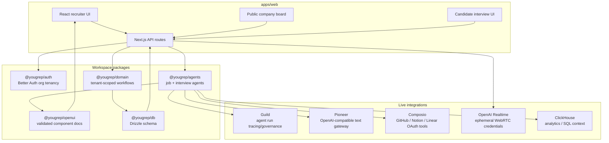
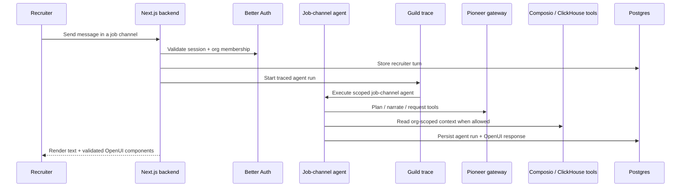
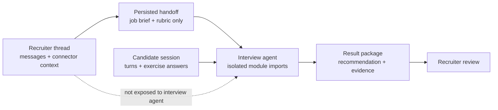
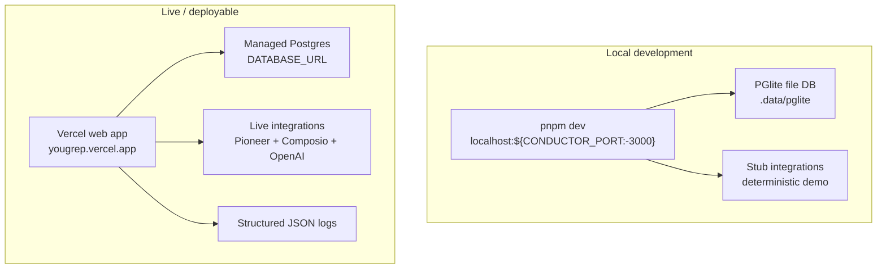

# Yougrep

**The recruiter workspace where every channel is a job.**

Live app: [yougrep.vercel.app](https://yougrep.vercel.app/)

Yougrep is a recruiter-agent workspace for companies hiring technical talent. It
feels like a Slack workspace where every channel is one job opening, and each
channel has a long-running agent that knows the role, company context,
connector data, candidates, and interview history.

Two surfaces are implemented:

- **Recruiter workspace** - create job channels, talk to the channel agent,
  connect org context, draft listings, publish to the org's own job board, and
  review candidates with generated scorecards.
- **Candidate interview** - from the public job board, candidates can apply and
  complete a structured interview with generated OpenUI exercises. Voice via
  OpenAI Realtime remains the stretch path; the current demo uses the text/UI
  interview flow.

OpenUI is constrained: agents emit validated documents made from predefined
components, never arbitrary model-generated code. Mutations such as publishing
a job require explicit confirmation.

## Quickstart

```bash
pnpm install
pnpm db:reset
pnpm db:seed
pnpm dev
```

Open [localhost:3000](http://localhost:3000) and sign in:

- **Email:** `demo@yougrep.dev`
- **Password:** `yougrep-demo-1234`

The seed creates the **Northwind Data** workspace with a published **Senior
Postgres Engineer** channel and three interviewed candidates. To try the
candidate side locally, open
[`/c/northwind-data`](http://localhost:3000/c/northwind-data), choose the role,
and apply with any email.

Requires Node 20+ and pnpm. The local loop defaults to `INTEGRATIONS_MODE=stub`
and PGlite, so no API keys, Docker, or external services are needed.

## How Yougrep Works

```mermaid
flowchart LR
  Recruiter["Recruiter"] --> Workspace["Recruiter workspace<br/>Next.js app"]
  Workspace --> Channel["Job channel<br/>one role per channel"]
  Channel --> Agent["Job-channel agent"]
  Agent --> Draft["OpenUI draft cards<br/>requirements, listing, review"]
  Draft --> Confirm["Explicit confirm gate"]
  Confirm --> Board["Owned public job board<br/>/c/{org-slug}/{job-slug}"]
  Board --> Candidate["Candidate apply + interview"]
  Candidate --> Results["Scores, transcript turns,<br/>result package"]
  Results --> Review["Recruiter review sidebar"]
  Review --> Workspace
```





## Agent And Data Boundaries





The tenant boundary is enforced in the domain layer: product queries are scoped
by `organization_id`, and backend routes check membership before returning
workspace data.

## Current Stack

| Role              | Current implementation                                                                  |
| ----------------- | --------------------------------------------------------------------------------------- |
| App               | TypeScript, Next.js 15, React 19, Turbopack                                             |
| Workspace         | pnpm monorepo; `@yougrep/*` packages are consumed as source via `transpilePackages`     |
| Auth + tenancy    | Better Auth with the Organization plugin                                                |
| Database          | Drizzle over PGlite locally; Drizzle over `node-postgres` when `DATABASE_URL` is set    |
| Agent runtime     | `@yougrep/agents`, wrapped in Guild run tracing and persisted `agent_runs`              |
| Text LLM gateway  | Pioneer, OpenAI-compatible chat completions with tool calling                           |
| Connectors        | Composio OAuth/tooling for org-scoped GitHub, Notion, and Linear connections            |
| Generated UI      | OpenUI contract with zod validation and predefined recruiter/interview React components |
| Voice path        | OpenAI Realtime `gpt-realtime-2` credential minting is wired; full voice UX is stretch  |
| Analytics/context | ClickHouse env contract and tool-loop integration points                                |
| Logging           | `@yougrep/logger`, pretty locally and JSON in production                                |
| Hosting           | Live preview on Vercel; `render.yaml` remains a Render web-service blueprint            |

TrueFoundry and Airbyte adapters are still present as legacy compatibility code
until the docs/sweep step removes the old blueprint references. The active path
in the app is Pioneer for text and Composio for connectors.

## Runtime Shape



`render.yaml` currently defines a free-tier Render web launch. Worker and cron
services are implemented in `apps/worker`, but are deferred in the Render
blueprint because Render worker/cron tiers require a paid plan. Interview result
packages are finalized inline; the worker is a reconciliation safety net.

## Monorepo Layout

| Package                 | Role                                                                                         |
| ----------------------- | -------------------------------------------------------------------------------------------- |
| `apps/web`              | Next.js app: landing, auth, recruiter workspace, public board, interview UI, API routes      |
| `apps/worker`           | Reconciliation worker and one-shot cron entrypoint                                           |
| `packages/config`       | Central env contract, root `.env` loading, integration mode resolution                       |
| `packages/db`           | Drizzle schema, PGlite/managed Postgres client, embedded migrations, reset/seed scripts      |
| `packages/auth`         | Better Auth setup and organization membership helpers                                        |
| `packages/domain`       | Tenant-scoped data access for jobs, candidates, interviews, postings, connectors, audit      |
| `packages/integrations` | Pioneer, Composio, Guild, OpenAI Realtime, ClickHouse-facing env paths, plus legacy adapters |
| `packages/logger`       | Shared structured logger                                                                     |
| `packages/openui`       | OpenUI schema, fixtures, safe server contract, React renderer/component libraries            |
| `packages/agents`       | Job-channel agent, isolated interview agent, tool loop, scoring, rubric/plan builders        |

## Development

```bash
pnpm typecheck
pnpm typecheck:web
pnpm lint
pnpm format:check
pnpm test
pnpm worker
```

Local development is designed as a closed loop: run the app locally, keep
external services stubbed by default, observe deterministic pass/fail, and only
flip individual integrations to `live` when testing real credentials.

Useful env switches live in [`.env.example`](./.env.example):

- `INTEGRATIONS_MODE=stub` keeps the entire local loop offline.
- `PIONEER_MODE=live` tests the text gateway without turning every service on.
- `COMPOSIO_MODE=live` exercises connector OAuth.
- `OPENAI_REALTIME_MODE=live` mints real Realtime credentials.
- `DATABASE_URL` switches `@yougrep/db` from local PGlite to managed Postgres.

See [`docs/local-dev.md`](./docs/local-dev.md) for the full dev-loop guide and
[`STATUS.md`](./STATUS.md) for the build log.

## Documentation

Design and stack docs live in [`docs/`](./docs/) and some still describe the
original June 2026 blueprint. For the currently implemented stack, trust this
README, [`.env.example`](./.env.example), [`render.yaml`](./render.yaml), and the
package source.

Start with [`docs/index.md`](./docs/index.md),
[`docs/mvp-architecture.md`](./docs/mvp-architecture.md), and
[`docs/implementation-blueprint.md`](./docs/implementation-blueprint.md) when
you need the original product rationale and build order.
